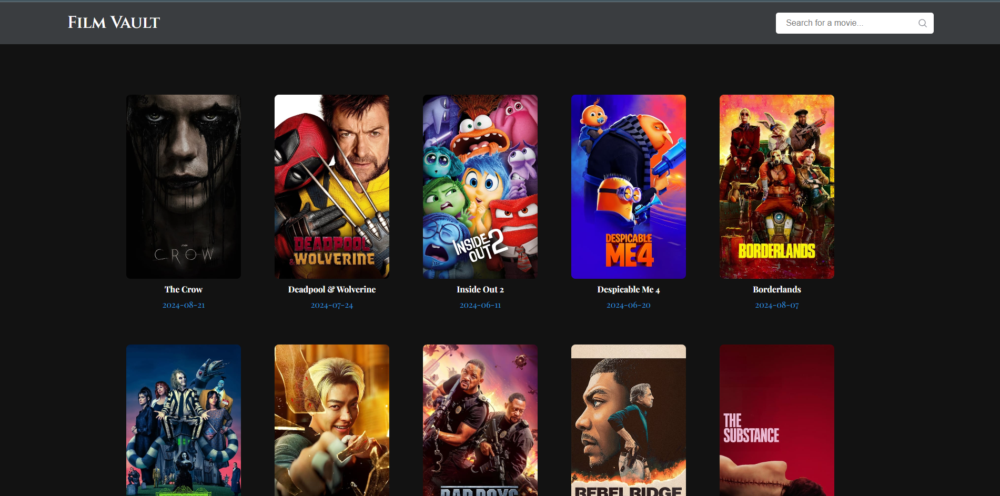
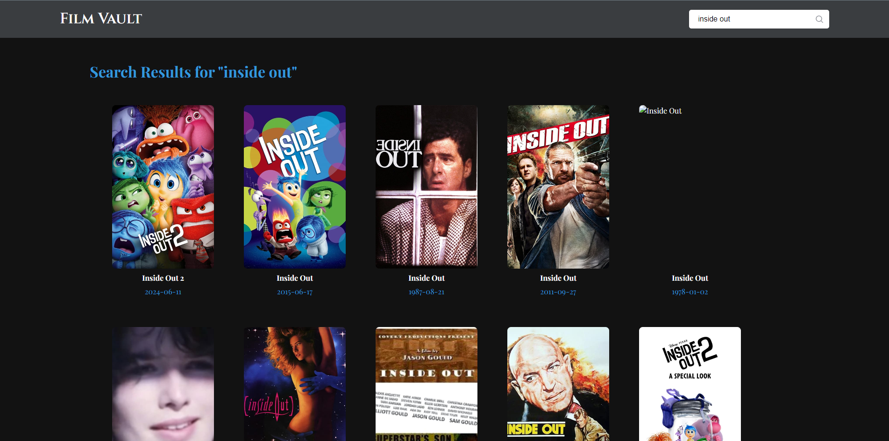
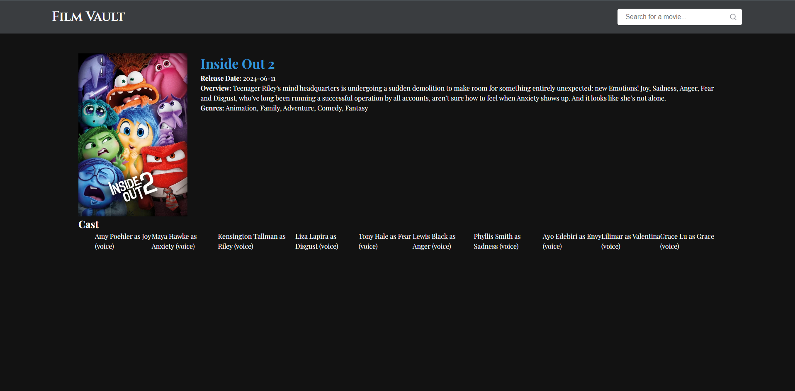

# FilmVault 🎬

**FilmVault** is a web application that allows users to browse and search for movies using the [TMDB API](https://www.themoviedb.org/documentation/api). It showcases popular movies and provides detailed information about individual films.



## Features

- **Popular Movies**: Browse through the most popular movies.
- **Movie Search**: Search for movies by title.
- **Movie Details**: View detailed information about a specific movie, including credits and videos.
- **Caching**: API responses are cached for 12 hours to improve performance and reduce API calls.
- **Pagination**: Browse movies across multiple pages.

## Installation

To run this project locally, follow these steps:

1. **Clone the Repository**
    ```bash
    git clone https://github.com/Chrisrose1992/FilmVault.git
    ```

2. **Navigate to the Project Directory**
    ```bash
    cd FilmVault
    ```

3. **Install Dependencies**
    ```bash
    npm install
    ```

4. **Set Up the Environment**
    Create a `.env` file in the root of your project and add your TMDB API key:
    ```
    TMDB_API_KEY=your_tmdb_api_key
    APP_PORT=3000
    ```

5. **Run the Application**
    To start the application, run:
    ```bash
    npm run dev
    ```

6. **View the Application**
    Visit `http://localhost:3000` in your browser.



## Project Structure

- **app.js**: Main entry point of the app.
- **routes/**: Contains route definitions.
- **controllers/**: Handles API requests and responses.
- **views/**: EJS templates for rendering pages.
- **public/**: Contains static files like CSS and images.
- **.env**: Environment variables (API keys and port settings).

## Technologies Used

- **Node.js**: Server-side JavaScript runtime.
- **Express.js**: Web framework for Node.js.
- **EJS**: Templating engine for rendering dynamic content.
- **Axios**: Promise-based HTTP client for API requests.
- **Node-Cache**: In-memory caching to reduce API calls.
- **TMDB API**: Movie database API for fetching movie information.
- **Helmet**: Basic security by setting HTTP headers.
- **Express-Rate-Limit**: Rate limiting to prevent abuse.

## Screenshots

### Home Page


### Search Results


### Movie Details


## Future Improvements

- Add TV show browsing and search functionality.
- User authentication and personalized movie lists.
- Add more advanced filtering options (e.g., by genre, release year).

## License

This project is licensed under the ISC License.

## Author

Created by **Chris Rose**.
